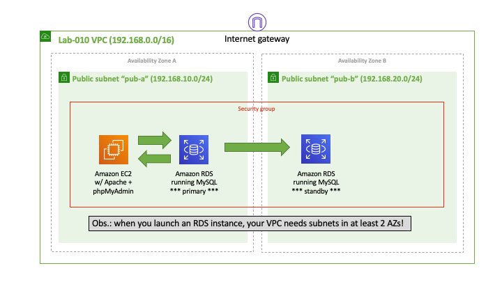
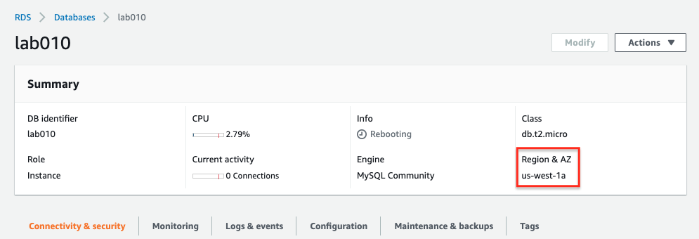
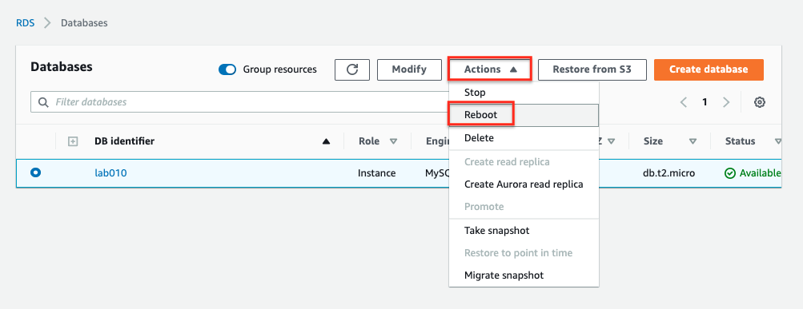
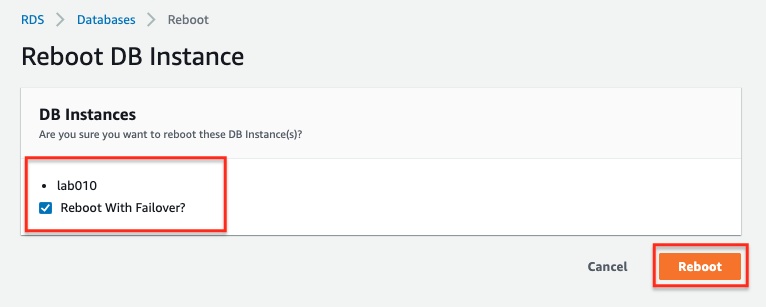
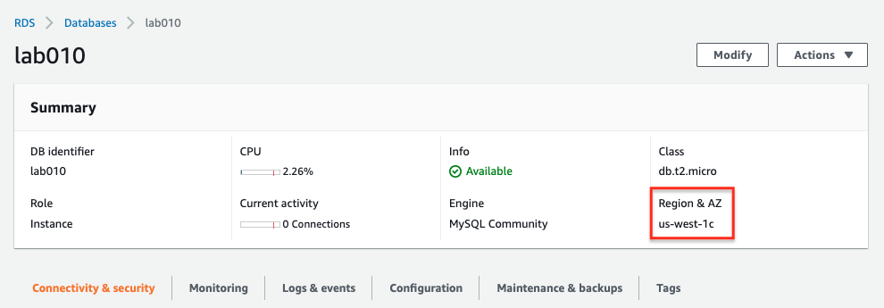

# Lab-010

## An RDS Instance with a Standby

Difficulty Level: 2

Creation Date: June 22, 2020

Original Author(s): [Thyago Mota](https://github.com/thyagomota)

Contributor(s):

## Goal
This lab is similar to [lab-009](../lab-009) with the addition of a standby RDS instance in another AZ to simulate a failover scenario.

## Architecture Diagram

## Overview
Having an RDS instance in a *multi-az* configuration means that another instance will run on standby mode in another AZ.  Writings done on the primary instance are also done on the secondary, and this is done synchronously. In the case of a failure of the primary, the secondary (the one running on standby mode) takes over and become the primary database instance.  

Follow the steps described in [lab-009](../lab-009) with the following changes when creating the RDS instance:

* Templates: Dev/Test (free-tier won't work this time)
* DB instance identifier: lab010
* DB instance size: select *Burstable classes* and pick the *db.t2.small*
* Multi-az deployment: select *multi-az* deployment (of course)
* Connectivity: set your custom VPC to be the one where your RDS instance will run; in the additional connectivity configuration - VPC security group, choose *Create new* and name it *lab010sg*; finally for the availability zone choose the one suffixed with 1a (or the first option that appears to you)
* Additional configurations: set the initial database name to *lab010* and disable automatic backups

## Test and Validation

Open a browser and using the EC2 instance's public IP address, connect to the database via phpMyAdmin in the same way explained in [lab-009](../lab-009). The screen below shows on which AZ the primary RDS instance is running.

To simulate a failure, select *Action* and then *Reboot*.

On the next screen, choose *Reboot With Failover*.

You should then notice that the secondary takes over and becomes the primary. You can attest that by verifying that the database is now running on a different AZ.

Make sure you can still access the database via phpMyAdmin. The change should take only a few seconds.
