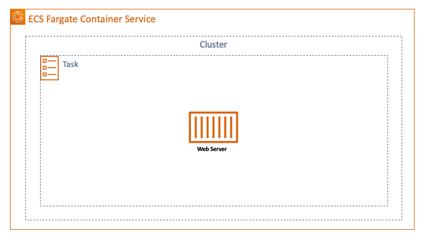
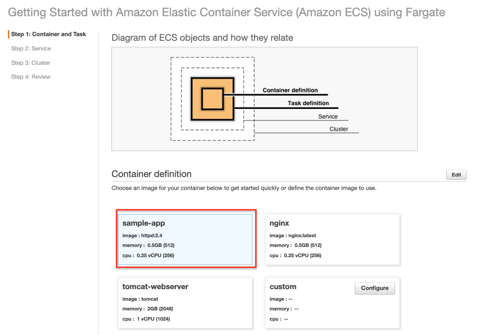
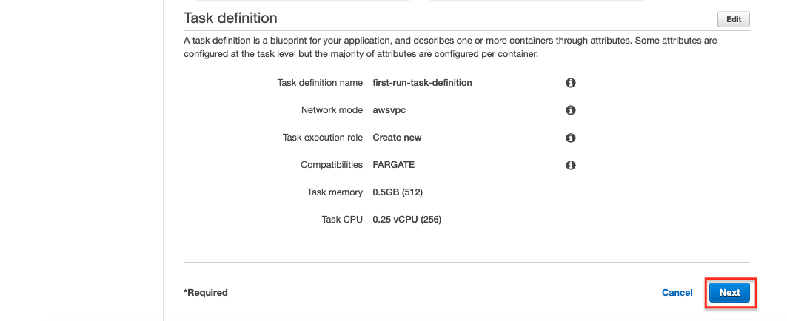
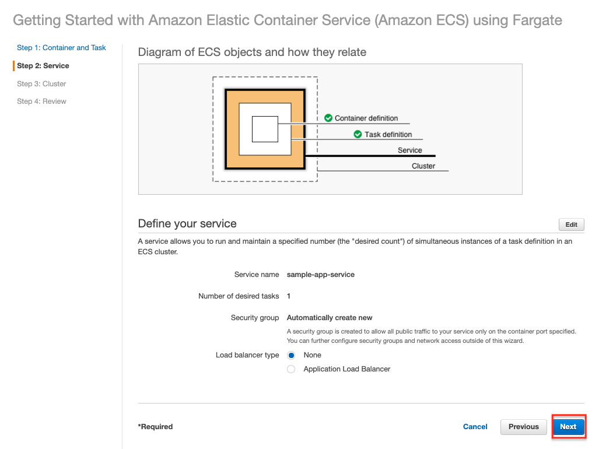
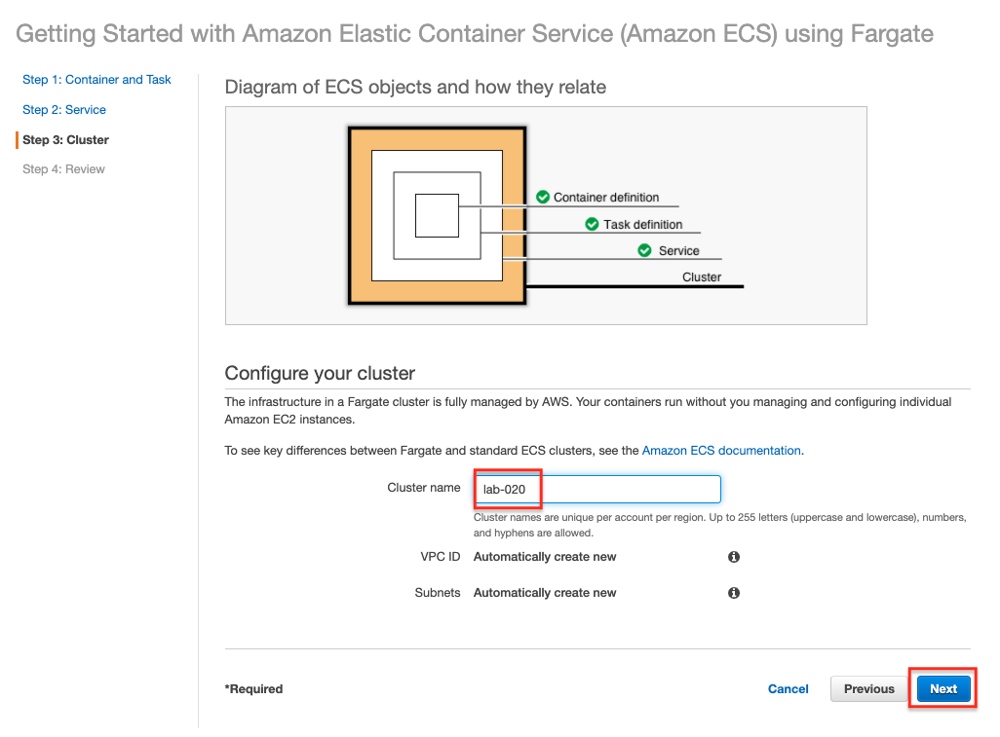
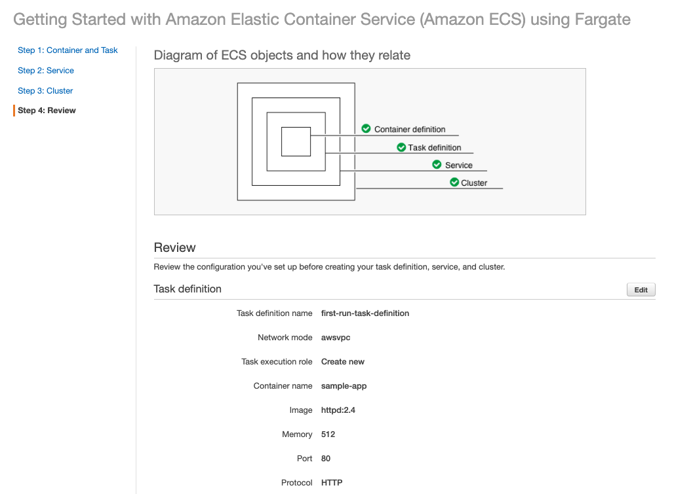
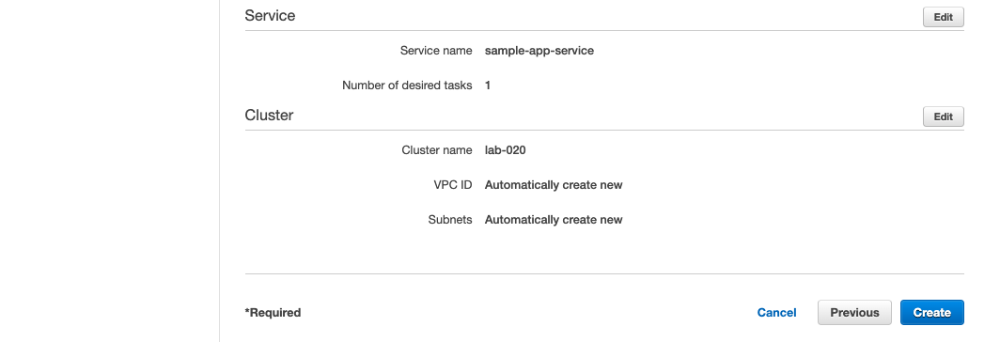
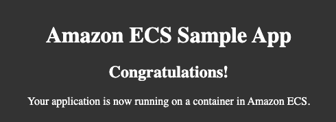

# Lab-020

## Running an Amazon ECS Sample App

Difficulty Level: 1

Creation Date: June 29, 2020

Original Author(s): [Thyago Mota](https://github.com/thyagomota)

Contributor(s):

## Goal

This lab illustrates how to launch a web server using Amazon ECS's [Fargate service](https://aws.amazon.com/fargate/).

## Architecture Diagram

## Overview

Fargate is a fully managed container service that automatically allocates computing resources to run containers with scaling capabilities. To best understand Amazon's Elastic Container Service let's break it into components:

* Container: packaging of an application including code, runtime, system tools, libraries, and everything else needed to run an application (a container is created from an image);
* Cluster: a logical group of tasks or services (this lab will create an ECS cluster containing a single task);
* Task: specified in JSON format, a task defines what to do (the application itself), where to run it (minimum infrastructure requirements), and how to run it (logging, scaling configurations, security configurations, etc.);
* Service: number of instances of tasks to run and launching parameters.

Note that a cluster can contain tasks that are running on distinct containers.

To start this lab go to ECS and click on *Get started*. This lab will create a Fargate cluster using the *sample-app* template.

### Step 1 - Choose a Container's Image

Select the *sample-app* container image which has definitions to run a web server using a single task.

### Step 2 - Provide Service Settings

For lab you can accept the default settings.

### Step 3 - Configure your Cluster

### Step 4 - Review

When the configuration is deployed, click on *view service*.

## Test and Validation

Click on *Tasks* an then on the single task displayed. Copy the public IP and test it using a browser. You should be able to see the web server initial page.

